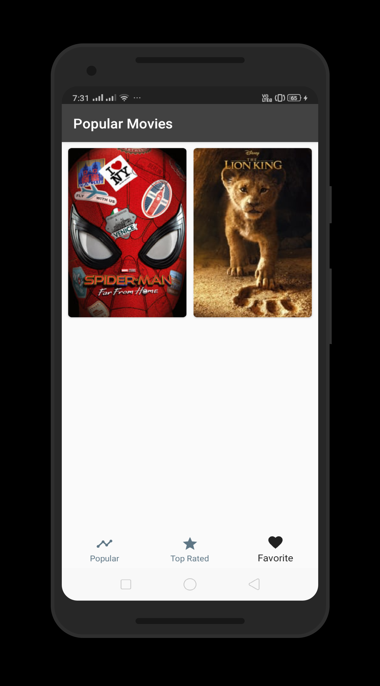

# PopularMovies

This is the second project in Udacity's Android Developer Nanodegree. The purpose of this project was to built an app, optimized for tablets, to help users discover popular and highly rated movies on the web. It displays a scrolling grid of movie trailers, launches a details screen whenever a particular movie is selected, allows users to save favorites, play trailers, and read user reviews. This app utilizes core Android user interface components and fetches movie information using themoviedb.org web API.

App uses The Movie Database API. You have to enter your API key in order to run the app. You can create your own one very easy! https://www.themoviedb.org/account/signup?language=en-EN. When you get it, just set it here: "com.jayhalani.popularmovies.utils.Constants"

## Tech Specs
- Language: Java
- Pattern: MVVM
- MinSdkVersion: 21
- TargetSdkVersion: 29
- Development Tool: Android Studio

## Libraries Used
* [Android Support Library](https://developer.android.com/topic/libraries/support-library/)
* [CardView](https://developer.android.com/guide/topics/ui/layout/cardview)
* [Volly](https://developer.android.com/training/volley/index.html)
* [Picasso](https://github.com/square/picasso)
* [Gson](https://github.com/google/gson)
* [RecyclerView](https://developer.android.com/guide/topics/ui/layout/recyclerview)
* [Room](https://developer.android.com/jetpack/androidx/releases/room)
* [ViewModel](https://developer.android.com/topic/libraries/architecture/viewmodel)
* [ViewModel](https://developer.android.com/topic/libraries/architecture/livedata)

## Screenshots

